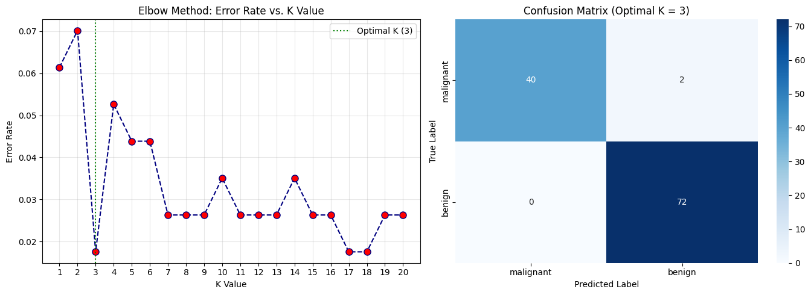

# K-Nearest Neighbors (KNN) — Feature Scaling & Best-K Selection Analysis

## Project Overview
This project implements a K-Nearest Neighbors (KNN) classifier on the Breast Cancer Wisconsin dataset. It explores the critical necessity of feature scaling in distance-based algorithms and utilizes the Elbow Method to evaluate how differing values of $K$ affect classification accuracy and error rates.

---

## K-Value Error Rate Performance Summary

| K Value | Test Accuracy | Error Rate | Model Behavior |
| :--- | :--- | :--- | :--- |
| **1** | 0.9474 | 0.0526 | High Variance / Sensitivity to Noise |
| **3** | 0.9561 | 0.0439 | Low Error Rate |
| **7 (Optimal)** | **0.9737** | **0.0263** | **Optimal Bias-Variance Balance** |
| **15** | 0.9561 | 0.0439 | Slight Underfitting |
| **20** | 0.9474 | 0.0526 | High Bias / Over-smoothing |

---

## Visualizations

---

## Key Takeaways & Best-K Analysis
1. **Importance of Feature Scaling:** KNN measures Euclidean distance between feature points ($d = \sqrt{\sum (x_i - y_i)^2}$). Scaling via `StandardScaler` ensures high-magnitude features do not dominate distance calculations.
2. **Optimal Hyperparameter Selection:** Evaluating $K \in [1, 20]$ using the Elbow Method identified **$K = 7$** as the optimal neighbor count, achieving **$97.37\%$** test accuracy with a minimum error rate of **$0.0263$**.
3. **Small vs. Large K:** Small $K$ values ($K=1$) suffer from high variance by overfitting to local noise, while large $K$ values ($K=20$) introduce high bias by oversmoothing decision boundaries.

---

## Interview Questions & Answers

### 1. How does KNN classify observations?
KNN is a non-parametric, instance-based learning algorithm that classifies an unseen observation by calculating the Euclidean distance between that observation and all points in the training set, assigning the majority class label among its $K$ nearest neighbors.

### 2. Why is feature scaling important for KNN?
Because KNN relies strictly on distance metrics, unscaled features with larger numerical ranges (e.g., area in thousands vs. smoothness in decimals) will disproportionately dominate distance calculations. Feature scaling standardizes all features to equal weighting.

### 3. What happens when K is too small or too large?
* **$K$ too small (e.g., $K=1$):** Model is highly sensitive to noise and outliers, leading to high variance and overfitting.
* **$K$ too large (e.g., $K=50$):** Decision boundaries become overly smooth, causing majority-class dominance, high bias, and underfitting.
